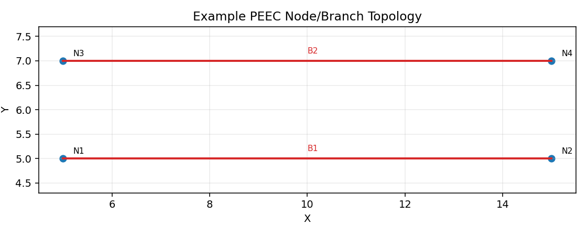
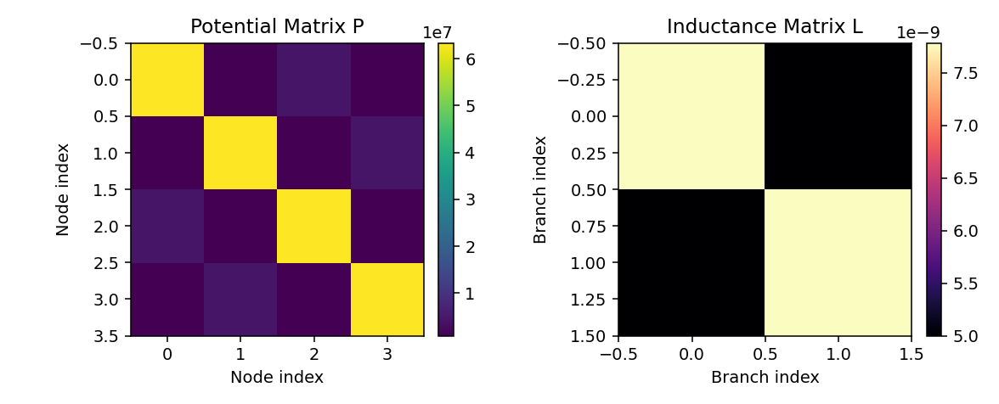

# Coarse_PEEC

A lightweight Python implementation of a coarse Partial Element Equivalent Circuit (PEEC) workflow.

This project reads node/branch geometry, computes:
- **Potential coefficient matrix** `P` (node-node electrostatic coupling)
- **Inductance matrix** `L` (branch-branch magnetic coupling)

and exports results to text files for further circuit-level analysis.

## Features

- Coarse PEEC matrix extraction with simple plain-text input
- Self and mutual potential coefficient computation (`P`)
- High-accuracy branch self-inductance integration + approximate mutual inductance (`L`)
- Modular code structure (`core`, `utils`, `scripts`)
- Optional README figures generated from example input/output

## Project Structure

```text
Coarse_PEEC/
  config.py
  main.py
  requirements.txt
  core/
    kernels.py
    solver.py
  utils/
    geometry.py
    io_handler.py
  data/
    Node.txt
    Branch.txt
  scripts/
    generate_readme_figures.py
  assets/images/          # generated figures for README
```

## Installation

Python 3.10+ is recommended.

```powershell
python -m pip install -r requirements.txt
```

## Input Format

### Node file: `data/Node.txt`

- First line: number of nodes
- Following lines: `x y z size`

Example:

```text
4
5.000000 5.000000 0.000000 1.000000
15.000000 5.000000 0.000000 1.000000
5.000000 7.000000 0.000000 1.000000
15.000000 7.000000 0.000000 1.000000
```

### Branch file: `data/Branch.txt`

- First line: number of branches
- Following lines: `node1 node2` (1-based node indices)

Example:

```text
2
1 2
3 4
```

## Usage

Run the main solver:

```powershell
python main.py
```

This produces:
- `P.txt`: potential coefficient matrix
- `L.txt`: inductance matrix

> Note: `main.py` currently calls `main(1000)` directly. If you want to use `config.UNIT_SCALE`, change the last line to `main()`.

## Method Overview

1. Load node and branch geometry
2. Compute `P` matrix
   - Diagonal: self potential by `cal_p_self`
   - Off-diagonal: mutual potential by `cal_p_oth`
3. Compute `L` matrix
   - Diagonal: branch self-inductance via sub-grid integration in `PEECSolver`
   - Off-diagonal: mutual inductance approximation by `cal_l_oth_approx`
4. Export matrices as plain text

## Figures

### Example topology



### Matrix heatmaps (`P` and `L`)



If images are missing, generate them with:

```powershell
python scripts/generate_readme_figures.py
```

## Configuration

Main configuration is in `config.py`:
- `E0`: vacuum permittivity
- `U0`: vacuum permeability
- `UNIT_SCALE`: unit scaling factor to meters
- `DEFAULT_GAUSS_ORDER`: Gaussian quadrature order
- `DEFAULT_DIV_X`, `DEFAULT_DIV_Y`: branch sub-grid divisions

## Limitations

- Current branch orientation handling is primarily 2D (XY-based coarse geometry)
- Mutual inductance (`L_ij`, `i != j`) uses midpoint approximation
- Numerical stability/accuracy for dense or very close geometries may require finer gridding and tuning

## Future Improvements

- Full 3D orientation support for branches
- Higher-order basis/testing functions
- Adaptive meshing for near-singular interactions
- Performance optimizations (vectorization/parallelization)

## License

No license has been added yet. If you plan to publish publicly, adding an MIT or Apache-2.0 license is recommended.

